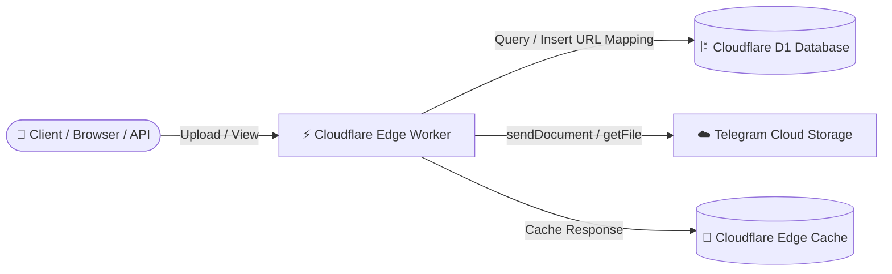

<div align="center">

# 🚀 CommonThread

**A high-performance, serverless media hosting platform built on Cloudflare Pages/Workers, backed by Telegram Cloud Storage and Cloudflare D1.**

[](LICENSE)
[](https://github.com/Itz-Ashlynn/AR_HOSTING)
[](https://pages.cloudflare.com/)
[](https://developers.cloudflare.com/d1/)
[](https://core.telegram.org/bots/api)

<br/>

[**Live Demo**](https://ar-hosting.pages.dev/) • [**API Documentation**](https://ar-hosting.pages.dev/docs) • [**Telegram Bot**](https://t.me/Imagehostssbot) • [**Deployment Guide**](#-deployment-guide) • [**API Reference**](#-api-reference) • [**Credits & Fork Info**](#-original-author--credits)

</div>

---

## 📖 Overview

**CommonThread** turns Telegram into an unlimited, zero-cost cloud storage backend for your web applications, bots, and personal media hosting. Powered by **Cloudflare Workers / Pages** at the edge and **Cloudflare D1 (Serverless SQLite)** for metadata indexing, CommonThread delivers lightning-fast uploads, edge-cached media streaming, and an administrative management dashboard.

This repository is an enhanced and modernized fork of [`0-RTT/telegraph`](https://github.com/0-RTT/telegraph).

---

## 🏗️ Architecture



1. **Upload Flow**: When media is uploaded (via Web UI, REST API, or URL ingestion), the Cloudflare Worker uploads the file to a private Telegram channel via the Telegram Bot API (`sendDocument`) and stores the `(url, fileId, filename)` mapping in Cloudflare D1.
2. **Retrieval Flow**: Incoming requests to `/<timestamp>.<ext>` query D1 for the Telegram `fileId`, stream the file directly from Telegram servers via `getFile`, apply security headers, and store the response in Cloudflare's global edge cache (`caches.default`) for sub-millisecond future requests.

---

## ✨ Features

- ⚡ **Zero-Cost Serverless Hosting**: Runs seamlessly on Cloudflare Pages/Workers free tier with Telegram as the storage backend.
- 📁 **Broad Format Support**: Host images (`.png`, `.jpg`, `.jpeg`, `.gif`, `.webp`, `.svg`, `.bmp`), videos (`.mp4`, `.mov`, `.avi`, `.webm`, `.mkv`), audio (`.mp3`, `.wav`), documents (`.pdf`, `.txt`, `.json`, `.csv`), and stickers.
- 🌐 **Dual Upload Endpoints**:
  - Direct multipart file uploads (`POST /upload`).
  - Remote URL ingestion and mirroring (`GET /hosturl?url=...`).
- 🚀 **Global Edge Caching**: Utilizes Cloudflare Cache API for instant global media delivery.
- 🎨 **Modern Web Interface**:
  - Glassmorphic, responsive dark/light mode UI.
  - Drag-and-drop & clipboard paste file upload.
  - Real-time upload progress tracking.
  - Client-side upload history cache (stored in `localStorage`).
  - Instant QR code generation & download for uploaded links.
- 🛡️ **Protected Admin Gallery (`/admin`)**:
  - Protected by HTTP Basic Authentication (`USERNAME` & `PASSWORD`).
  - Infinite scroll with lazy loading (`IntersectionObserver`).
  - Batch selection & link copying (Direct URLs, Markdown, BBCode).
  - Batch file deletion (`POST /delete-images`) with automatic edge cache invalidation.
- 🔒 **Security Hardened**:
  - Executable/script files (`.html`, `.js`, `.css`, `.xml`, `.svg`) are served with `Content-Disposition: attachment` to prevent XSS and malicious script execution.
  - Safe media formats are served `inline` for smooth in-browser rendering.
  - Granular authentication controls (`ENABLE_AUTH`).
- 📚 **Built-in Interactive API Docs**: Clean, responsive documentation page served at `/docs`.
- 🖼️ **Curated Wallpaper Feed**: Built-in `/wallpapers` endpoint to discover HD wallpapers.

---

## 🗂️ Project Structure

```text
AR_HOSTING/
├── _worker.js             # Core all-in-one Cloudflare Pages / Worker script
├── wrangler.toml.example  # Configuration template for Wrangler CLI deployment
├── LICENSE                # MIT License
└── README.md              # Project documentation
```

---

## 🚀 Deployment Guide

### Prerequisites

1. A [Cloudflare Account](https://dash.cloudflare.com/) (free tier is sufficient).
2. A **Telegram Bot Token**:
   - Open Telegram and message [@BotFather](https://t.me/BotFather).
   - Send `/newbot` and follow the prompts to create your bot. Copy the generated `TG_BOT_TOKEN`.
3. A **Telegram Channel/Group**:
   - Create a new Telegram channel or group.
   - Add your bot as an **Administrator** with permission to post messages.
   - Obtain the Channel ID (e.g., `-1001234567890`) using [@userinfobot](https://t.me/userinfobot) or by forwarding a message to [@JsonDumpBot](https://t.me/JsonDumpBot).

---

### Step 1: Create Cloudflare D1 Database

1. In the Cloudflare Dashboard, navigate to **Storage & Databases** > **D1 SQL Database**.
2. Click **Create Database**, name it `ar_hosting_db`, and click **Create**.
3. Open the **Console** tab of your new D1 database and execute the following SQL command:

```sql
CREATE TABLE IF NOT EXISTS media (
  url TEXT PRIMARY KEY,
  fileId TEXT NOT NULL,
  filename TEXT
);
```

*(Optional: If using Wrangler CLI, run:)*
```bash
npx wrangler d1 create ar_hosting_db
npx wrangler d1 execute ar_hosting_db --command "CREATE TABLE IF NOT EXISTS media (url TEXT PRIMARY KEY, fileId TEXT NOT NULL, filename TEXT);"
```

---

### Step 2: Deploy to Cloudflare Pages (Recommended)

1. **Fork or Clone** this repository:
   ```bash
   git clone https://github.com/Itz-Ashlynn/AR_HOSTING.git
   cd AR_HOSTING
   ```
2. In Cloudflare Dashboard, go to **Workers & Pages** > **Create application** > **Pages** > **Connect to Git**.
3. Select your repository `AR_HOSTING`.
4. Configure the build settings:
   - **Framework preset**: `None`
   - **Build command**: *(leave blank)*
   - **Build output directory**: `/` (root)
5. Click **Save and Deploy**.

---

### Step 3: Bind D1 Database & Environment Variables

1. Go to your Cloudflare Pages project > **Settings** > **Functions**.
2. Scroll down to **D1 database bindings**:
   - Click **Add binding**.
   - **Variable name**: `DATABASE`
   - **D1 database**: Select `ar_hosting_db`.
3. Go to **Settings** > **Environment variables** > **Production** (and Preview if needed) and configure the variables:

| Variable | Required | Default | Description |
| :--- | :---: | :---: | :--- |
| `DOMAIN` | **Yes** | — | Your deployed domain without protocol (e.g. `ar-hosting.pages.dev` or `cdn.yourdomain.com`). |
| `TG_BOT_TOKEN` | **Yes** | — | Telegram Bot API Token obtained from `@BotFather`. |
| `TG_CHAT_ID` | **Yes** | — | Telegram Channel/Group ID where files are uploaded (e.g. `-1001234567890`). |
| `DATABASE` | **Yes** | — | Cloudflare D1 Database binding name (must match `DATABASE`). |
| `USERNAME` | **Yes** | — | Admin username for `/admin`, `/admin/api/media`, and deletion. |
| `PASSWORD` | **Yes** | — | Admin password for `/admin`, `/admin/api/media`, and deletion. |
| `ENABLE_AUTH` | No | `false` | Set to `true` to require HTTP Basic Auth for **public uploads** (`/upload`, `/hosturl`) and root page (`/`). |
| `MAX_SIZE_MB` | No | `20` | Maximum file size limit in MB (default is `20`). |

> [!NOTE]
> **Understanding Authentication:**
> - **Admin Endpoints** (`/admin`, `/admin/api/media`, `/delete-images`): **Always require** `USERNAME` and `PASSWORD` regardless of the `ENABLE_AUTH` setting.
> - **Public Endpoints** (`/`, `/upload`, `/hosturl`): Open to everyone by default. Setting `ENABLE_AUTH="true"` locks them behind Basic Auth using the same `USERNAME` and `PASSWORD`.

4. Go to **Deployments** and trigger a **Retry deployment** so the new bindings and environment variables take effect.

---

### Alternative: Deploy via Wrangler CLI

1. Copy the example configuration:
   ```bash
   cp wrangler.toml.example wrangler.toml
   ```
2. Configure your `database_id`, `TG_BOT_TOKEN`, `TG_CHAT_ID`, and credentials in `wrangler.toml`.
3. Deploy directly to Cloudflare Pages:
   ```bash
   npx wrangler pages deploy . --project-name ar-hosting
   ```

---

## 📡 API Reference

### 1. Direct File Upload (Multipart Form)

Upload any supported image, video, audio, or document file.

- **Endpoint**: `POST /upload`
- **Content-Type**: `multipart/form-data`
- **Body**: `file` (Binary file content)

#### cURL Example
```bash
curl -X POST https://ar-hosting.pages.dev/upload \
  -F "file=@/path/to/image.png"
```

#### JavaScript Example
```javascript
const formData = new FormData();
formData.append('file', fileInputElement.files[0]);

const res = await fetch('https://ar-hosting.pages.dev/upload', {
  method: 'POST',
  body: formData
});

const data = await res.json();
console.log('Hosted URL:', data.url);
```

#### Response (`200 OK`)
```json
{
  "data": "https://ar-hosting.pages.dev/1753020712833.png",
  "url": "https://ar-hosting.pages.dev/1753020712833.png",
  "filename": "image.png",
  "size": 83638,
  "uploaded_on": "2026-08-19T14:11:52.833Z",
  "media_type": "image/png",
  "creator": "https://t.me/Ashlynn_Repository"
}
```

---

### 2. Remote URL Upload

Download a file from an external URL and host it directly on CommonThread.

- **Endpoint**: `GET /hosturl?url=<REMOTE_URL>`

#### cURL Example
```bash
curl "https://ar-hosting.pages.dev/hosturl?url=https://images.unsplash.com/photo-1579783902614-a3fb3927b675"
```

#### Response (`200 OK`)
```json
{
  "data": "https://ar-hosting.pages.dev/1753020799102.jpeg",
  "url": "https://ar-hosting.pages.dev/1753020799102.jpeg",
  "filename": "photo-1579783902614-a3fb3927b675",
  "size": 245910,
  "uploaded_on": "2026-08-19T14:13:19.102Z",
  "media_type": "image/jpeg",
  "creator": "https://t.me/Ashlynn_Repository"
}
```

---

### 3. Retrieve Hosted Media

- **Endpoint**: `GET /<timestamp>.<ext>`
- **Behavior**: Streams media directly with appropriate `Content-Type` and edge caching. Potentially harmful formats (`html`, `js`, `svg`) are served as downloads to prevent script injection.

---

### 4. Admin Paginated Media API

Fetch paginated lists of hosted media records.

- **Endpoint**: `GET /admin/api/media?page=1&limit=100`
- **Headers**: `Authorization: Basic <base64(username:password)>`

#### Response (`200 OK`)
```json
{
  "media": [
    {
      "fileId": "BAACAgIAAxkBAAI...",
      "url": "https://ar-hosting.pages.dev/1753020712833.png"
    }
  ],
  "total": 1250,
  "page": 1,
  "limit": 100,
  "has_more": true
}
```

---

### 5. Batch Delete Media (Admin Only)

Delete records from the D1 database and invalidate Cloudflare Edge Cache.

- **Endpoint**: `POST /delete-images`
- **Headers**:
  - `Authorization: Basic <base64(username:password)>`
  - `Content-Type: application/json`
- **Body**: Array of URL strings to delete

```bash
curl -X POST https://ar-hosting.pages.dev/delete-images \
  -u "admin:YourSuperSecretPassword" \
  -H "Content-Type: application/json" \
  -d '["https://ar-hosting.pages.dev/1753020712833.png"]'
```

---

### 6. Wallpaper Feed

- **Endpoint**: `GET /wallpapers`
- **Behavior**: Returns curated wallpaper data in JSON format with edge caching.

---

## 🤖 Telegram Bot Integration

You can pair CommonThread with a dedicated Telegram bot (such as [@Imagehostssbot](https://t.me/Imagehostssbot)):

1. Start a chat with the bot on Telegram.
2. Send any photo, video, document, audio track, or media URL.
3. The bot uploads the media and returns a direct public CommonThread link.

---

## 👏 Original Author & Credits

- **Original Project**: [`0-RTT/telegraph`](https://github.com/0-RTT/telegraph) by [0-RTT](https://github.com/0-RTT).
- **Fork Maintainer & Modifications**: [Aarabh](https://github.com/Itz-Ashlynn) ([CommonThread](https://t.me/Ashlynn_Repository) / [@Commonthread](https://t.me/Commonthread)).

### 🌟 Key Enhancements in this Fork
1. **Cloudflare D1 SQL Integration**: Replaced legacy KV/binding lookups with Cloudflare D1 for persistent, relational metadata tracking and fast indexed queries.
2. **Infinite Scroll Admin Gallery**: Re-engineered `/admin` with paginated API (`/admin/api/media`), lazy loading (`IntersectionObserver`), multi-format export (Markdown/BBCode/URLs), and batch deletion with Cloudflare edge cache purging.
3. **Advanced Web UI**: Modern glassmorphic interface with client-side SHA-256 hash caching, local history drawer, QR code generation and download, and responsive dark/light themes.
4. **Enhanced Security**: Automatic content disposition adjustment for potentially executable files (`html`, `js`, `svg`, `xml`) to mitigate web security vulnerabilities.
5. **Interactive `/docs`**: Built-in, responsive API documentation page.
6. **Broader Media Support**: Direct handling for audio (`mp3`, `wav`), documents, stickers, and automatic GIF conversion for Telegram compatibility.

---

## 📄 License

This project is open source and available under the [MIT License](LICENSE).

---

## ⚠️ Disclaimer

CommonThread is an independent, open-source project intended for personal, educational, and authorized media hosting purposes. It is not officially affiliated with or endorsed by Telegram or Cloudflare. Users are responsible for ensuring that uploaded media complies with relevant laws, terms of service, and copyright regulations.
